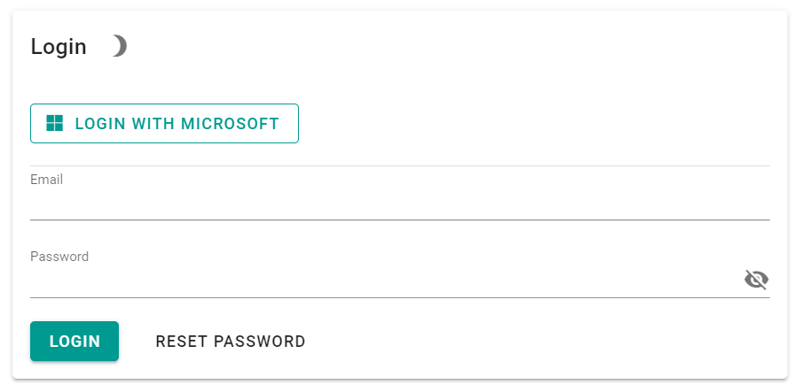
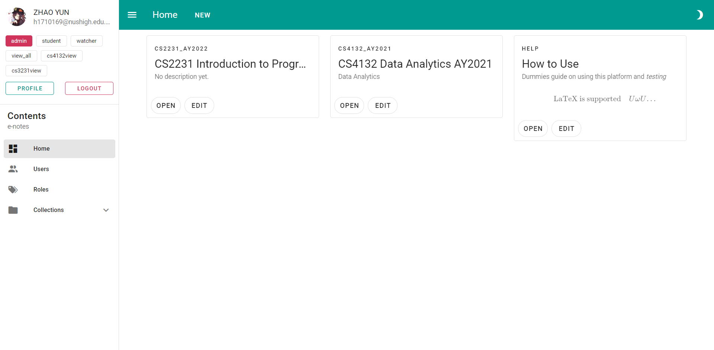

# 1. Basics

### Login

- Login via Microsoft Account, please use school email
  - Remember to verify your account via the email you should have received in your inbox
- Login via email/password pair
  - For those that has fancy auto complete built into the browser and would like to take advantage of it
  - You can click on reset password to set a password to use for login
    - Note that there is no 2FA in place

### Layout

The UI is divided into two parts, the navigation drawer and the main content, pretty self explanatory.

### Collection

- A collection is a collection of notes and images.
- It can represent a module, a submodule, or just a collection.
- It has an owner, who has full access over the collection
- 