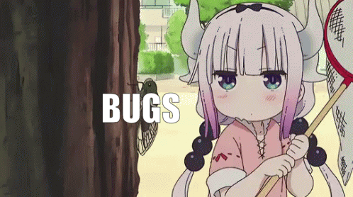

# 1. Basics

## Contents

1. [Basics](../basics)
2. [Collections](../collections)
   1. [Notes](../notes)
3. [Permissions](../permissions)

### Login

- Remember to verify your account via the email you should have received in your inbox

### Error/Bug Reporting

<small>Click the Image to report bugs</small>

### Layout

The UI is divided into two parts, the navigation drawer and the main content, pretty self explanatory.

You can click on **Open** to open/view a collection

And on **New** to create a new collection