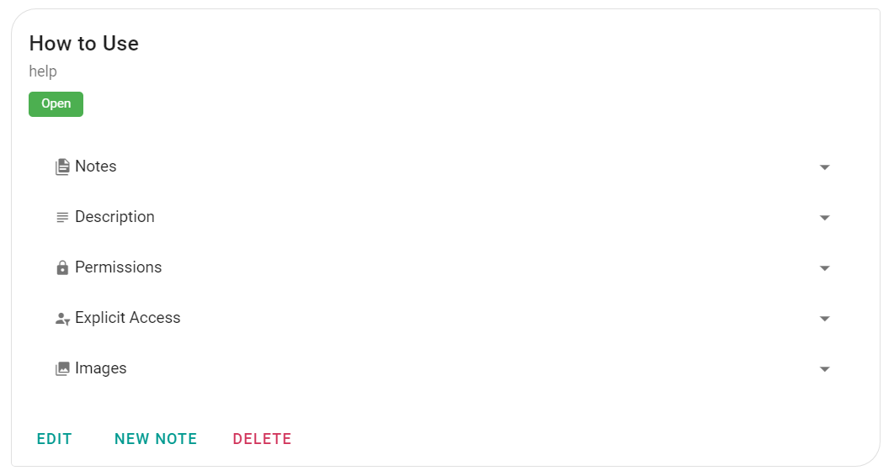
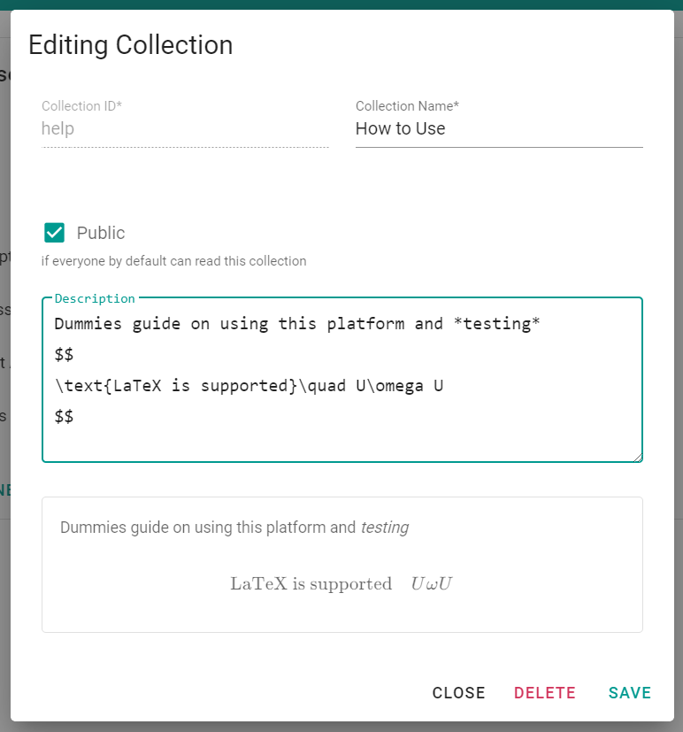
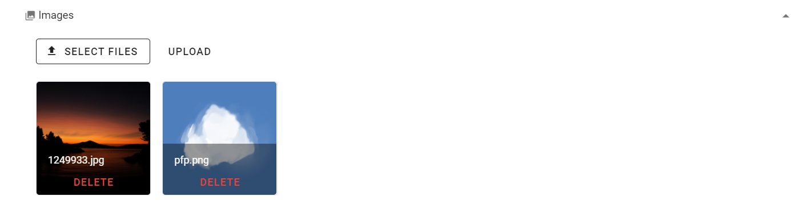
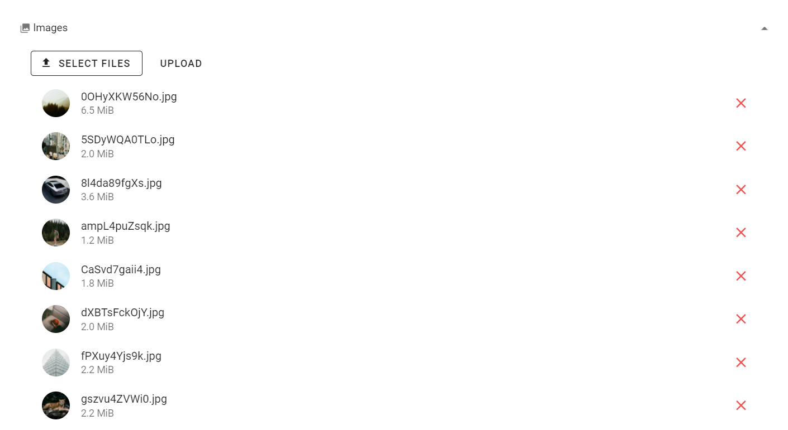
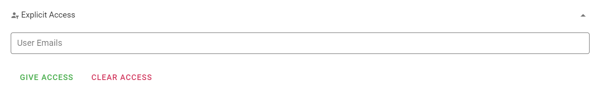
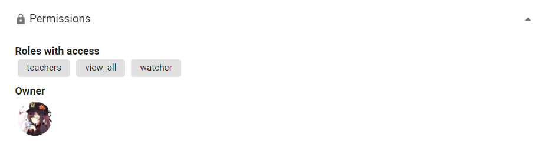

# 2. Collection

[[toc]]

### About

- A collection is a collection of notes and images.
- It can represent a module, a submodule, or just a collection.
- It has an owner, who has full access over the collection
- For creating/deleting/editing notes check [Notes](../notes)

### Editing/Creating Collection

They both share the same UI for inputs.

##### Collection ID

- It has to be URL safe, if not the UI should warn you about it
- It has to be unique, only 1 collection can exist per collection ID
- It may be referred to as `cid` in certain context

##### Collection Name

Anything you want, favorably not too long

##### Public

If the collection is public and visible to everyone, except those who are explicated denied access

##### Description

Anything you want, Markdown is supported

[View Markdown Help](/collection/help/markdown)

### Uploading Images

1. Press **SELECT FILES** and select images to upload

You can remove images from the upload list by clicking on the 'x' button

2. Press **UPLOAD** to upload images, note that it may take a while and do not close the tab while its uploading

### Deleting Images

Simply click the delete underneath the image in the gallery, no confirm windows, immediate deletion from storage

However it may still be cached on the client side

### Explicit view access

You can explicitly grant view access to users via this section, its not as manageable as using roles but it will overwrite the view permission for a specific user and this may be useful in some cases.

### Permission Overview

Here you can see the roles that has view access, and the owner of the collection, click on the avatar for more info
