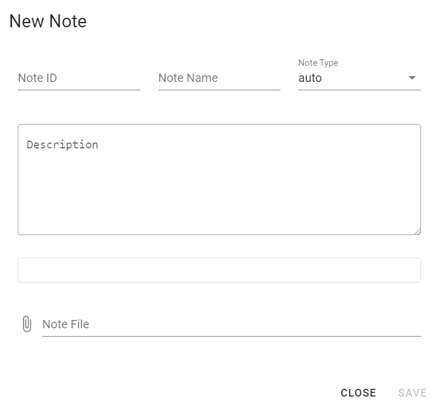
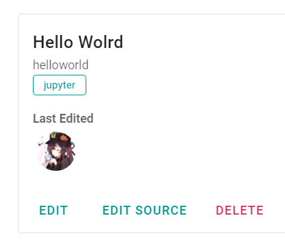

# Notes

Click on **NEW NOTE** in collection page to open up note creation/editing UI

- Note ID must be unique, but only to the collection
- Note Name can be anything
- Note type is how the document uploaded will be displayed
  - Markdown, a `.md` file that will be rendered as markdown
  - Jupyter, a `.ipynb` jupyter notebook file
  - HTML, a plain `html` file
  - Auto, let the server set the type for you based on the file extention, if you are not concerned or having issues, just leave it at auto
- Description can be anything, markdown is supported
- Note File, the file itself
  - Although creation of a note without a file is allowed, not advisable

### Display

Starting from the top

- Note name
- Note ID
- Note type
- Last edited user, you can click on the profile image to view more details
- Actions
  - Edit, edit the note, opens the UI said above
  - Edit source, edit the note's file directly, may be useful for quickly fixing errors
    - Supports markdown and html
  - Delete, deletes the note

### Images

Images used in the note must use relative path, and follow one of the following format

Casing is not important

- `./images/[file name]`
- `./img/[file name]`
- `[file name]`
- `./[file name]`
- `../images/[file name]`
- `../img/[file name]`
- `../[file name]`

Using direct file names may be ambiguous and is not recommended (without the `images`)
